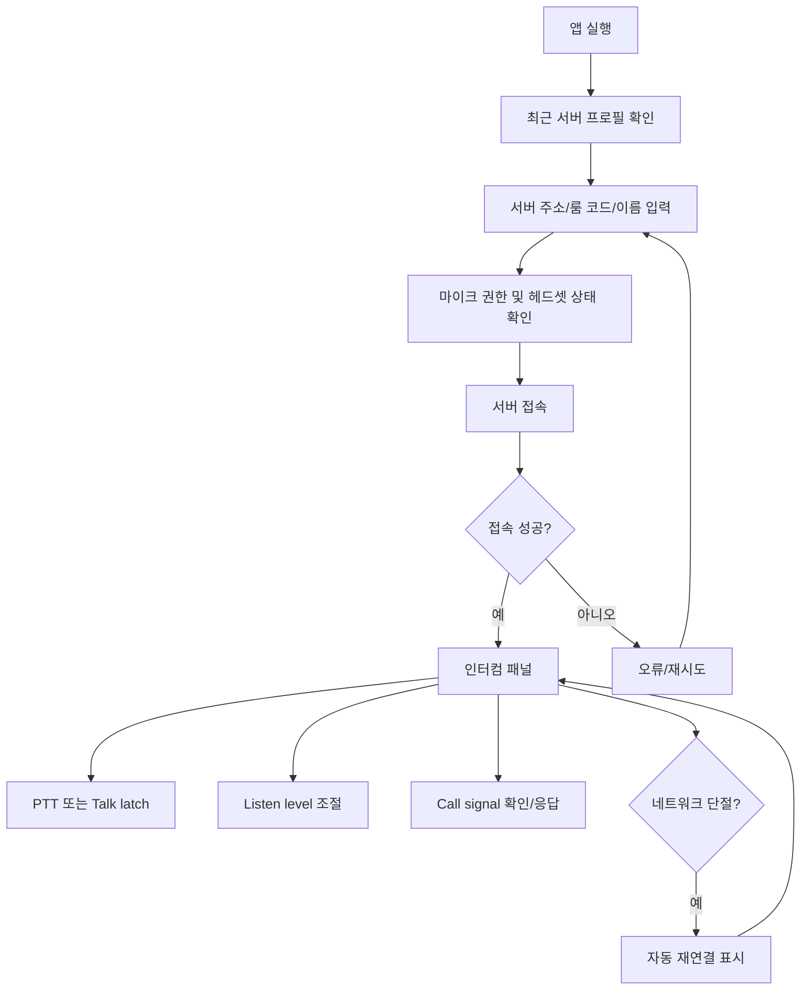
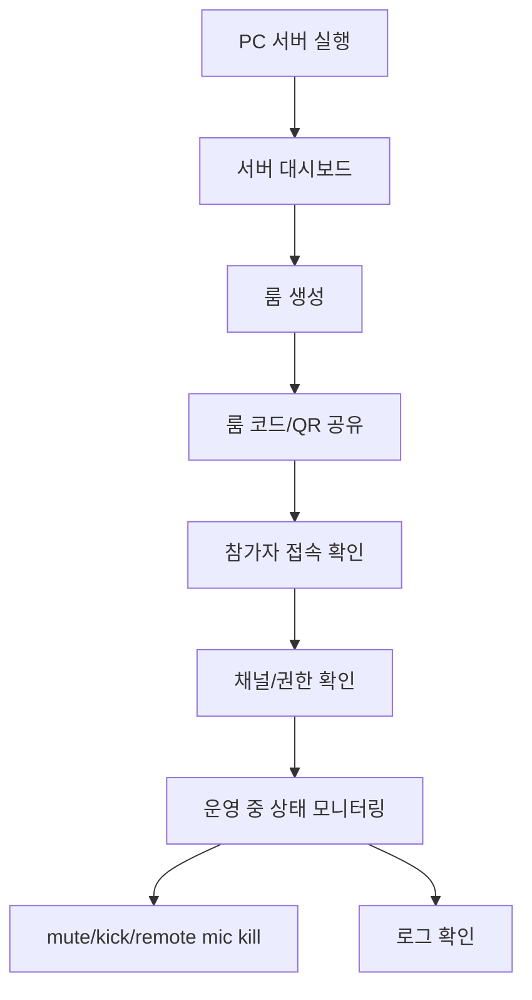

# 사용자 흐름

## Android 사용자

```mermaid
flowchart TD
  A["앱 실행"] --> B["최근 서버 프로필 확인"]
  B --> C["서버 주소/룸 코드/이름 입력"]
  C --> D["마이크 권한 및 헤드셋 상태 확인"]
  D --> E["서버 접속"]
  E --> F{"접속 성공?"}
  F -->|예| G["인터컴 패널"]
  F -->|아니오| H["오류/재시도"]
  H --> C
  G --> I["PTT 또는 Talk latch"]
  G --> J["Listen level 조절"]
  G --> K["Call signal 확인/응답"]
  G --> L{"네트워크 단절?"}
  L -->|예| M["자동 재연결 표시"]
  M --> G
```

## PC 운영자

```mermaid
flowchart TD
  A["PC 서버 실행"] --> B["서버 대시보드"]
  B --> C["룸 생성"]
  C --> D["룸 코드/QR 공유"]
  D --> E["참가자 접속 확인"]
  E --> F["채널/권한 확인"]
  F --> G["운영 중 상태 모니터링"]
  G --> H["mute/kick/remote mic kill"]
  G --> I["로그 확인"]
```
