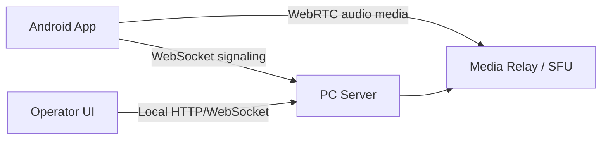

# 아키텍처 초안

## 결론

1차 구현은 WebRTC + Opus 기반이 적합하다. LTE 환경에서는 NAT traversal, jitter buffer, packet loss concealment, echo cancellation 같은 음성 통신 기본기가 중요하므로 직접 UDP/RTP 스택을 만드는 방식은 MVP 리스크가 크다.

## 전체 구조

## 구성 요소

### Android App

- Kotlin native 앱으로 시작한다.
- WebRTC Android SDK를 사용한다.
- Android AudioManager로 유선/USB-C/블루투스 헤드셋 라우팅을 제어한다.
- Foreground service로 백그라운드 통화 유지 정책을 맞춘다.

### PC Server

- 초기에는 서버와 운영 UI를 분리해 단순하게 만든다.
- 서버는 룸, 참가자, signaling, media relay 연동을 담당한다.
- 운영 UI는 브라우저 기반 로컬 웹 화면으로 제공하고, 패키징 단계에서 Tauri를 검토한다.

### Media Layer

선택지는 두 가지다.

1. 검증된 media server 사용
   - LiveKit, mediasoup, Janus 같은 WebRTC SFU 사용
   - 장점: 안정성, NAT/ICE 처리, 품질 제어
   - 단점: 배포 구조가 조금 커짐

2. 서버 내장형 구현
   - Go + Pion WebRTC 등으로 직접 relay 구성
   - 장점: 단일 실행 파일에 가까운 PC 서버 가능
   - 단점: 다자 음성 품질과 운영 안정성 검증 부담

MVP는 1번을 우선 검토하고, 단일 PC 설치형 요구가 강하면 2번으로 좁힌다.

## 통신 흐름

1. Android 앱이 서버 주소와 룸 코드로 접속한다.
2. 앱과 PC 서버가 WebSocket으로 signaling을 교환한다.
3. 서버가 참가 가능 여부를 확인한다.
4. WebRTC offer/answer와 ICE candidate를 교환한다.
5. 음성 media는 SFU 또는 relay를 통해 각 참가자에게 전달된다.
6. 연결 품질, mute, PTT 상태는 signaling 채널로 동기화한다.

## 주요 기술 결정

| 항목 | 결정 | 이유 |
| --- | --- | --- |
| 모바일 1차 대상 | Android native Kotlin | 헤드셋, 백그라운드 오디오, 저지연 제어가 중요함 |
| 음성 코덱 | Opus | WebRTC 표준 저지연 음성 코덱 |
| signaling | WebSocket | 양방향 상태 동기화가 단순함 |
| media transport | WebRTC | LTE NAT traversal과 패킷 손실 대응에 유리함 |
| PC UI | Local web UI first | 서버 검증이 먼저이고 패키징은 나중에 분리 가능 |

## 열린 결정 사항

- PC 서버가 반드시 인터넷 없이 같은 사설망에서만 동작해야 하는가
- 외부 LTE 단말이 PC 서버에 접속할 때 포트포워딩을 허용할 수 있는가
- TURN 서버를 별도로 둘 수 있는가
- 동시 접속 목표 인원은 몇 명인가
- PTT 중심인지 항상 열린 인터컴인지
